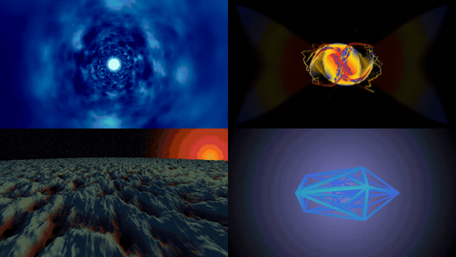

# ShaderToy Projects

A small collection of GLSL experiments built for ShaderToy: https://www.shadertoy.com/user/CarsonSS.

## Projects

| Project | Preview |
| --- | --- |
| [Star Wars Hyperspace](Star%20Wars%20HyperSpace/) | 3D and 4D animated hyperspace |
| [Particle Fluid Simulation](Particle%20Fluid%20Simulation/) | Particle-based fluid motion |
| [Simplex Terrain Generation](Simplex%20Terrain%20Generation/) | Procedural terrain and alien sunset |
| [Icositetrachoron](Icositetrachoron/) | Animated 4D geometry |
| [Spirographs](Spirographs/) | Procedural spirograph patterns |
| [Glyph Renderer](Glyph%20Renderer/) | Shader-based glyph rendering |

