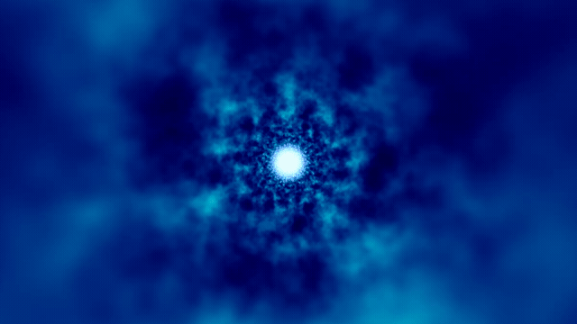
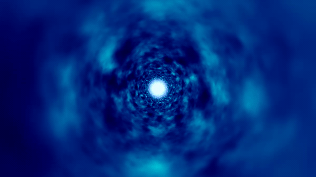

# Star Wars Hyperspace

GLSL fragment shader experiments inspired by hyperspace effects, built with 3D and 4D simplex noise.

## 3D Hyperspace

[`hyperspace_3D.frag`](hyperspace_3D.frag) · [View on ShaderToy](https://www.shadertoy.com/view/WfKSRW)

## 4D Hyperspace

[`hyperspace_4D.frag`](hyperspace_4D.frag) · [View on ShaderToy](https://www.shadertoy.com/view/wcKSDz)
